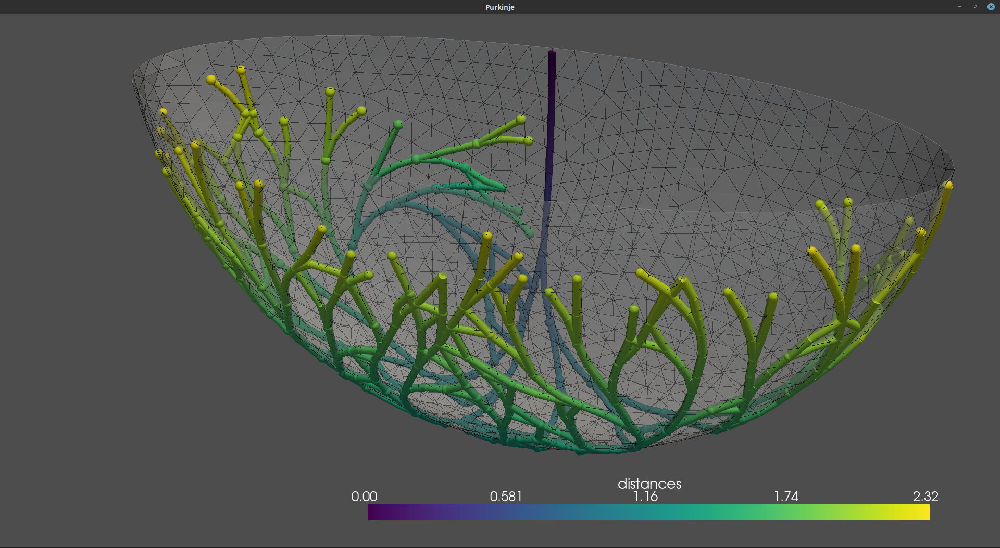
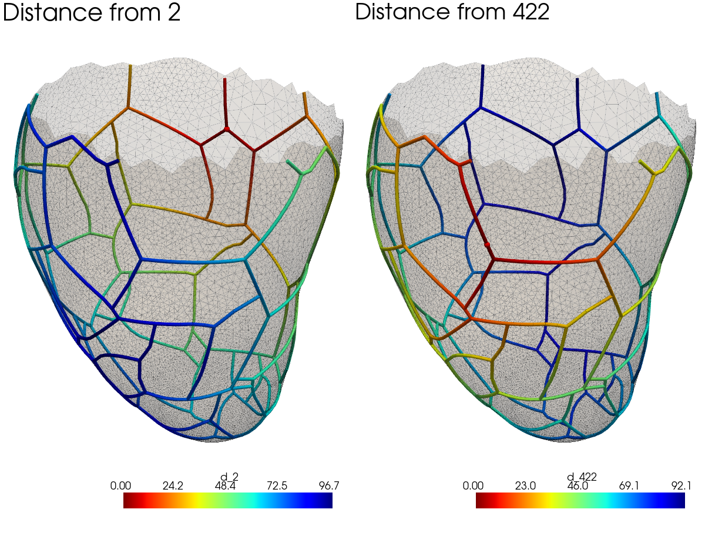

# FractalTree

*Forked from https://github.com/fsahli/fractal-tree*


This code is to create a fractal tree over a surface discretized by triangles. It was developed to create a representation of the Purkinje network in the ventricles of the human heart.

The details of the algorithm are presented in this [article](http://www.sciencedirect.com/science/article/pii/S0021929015007332). If you are going to use this code, please cite:

	Generating Purkinje networks in the human heart.
	F. Sahli Costabal, D. Hurtado and E. Kuhl.
	Journal of Biomechanics, doi:10.1016/j.jbiomech.2015.12.025


### Install
```bash
pip install FractalTree
# or
git clone https://github.com/GaetanDesrues/fractal-tree FractalTree
python setup.py build_ext --inplace
cd FractalTree/FractalTree/core
python setup.py build_ext --inplace

#You may have to add this line to Cython/Includes/libcpp/algorithm.pxd:
Iter min_element[Iter](Iter first, Iter last) except +

# Test
python test_install.py

#python setup.py build_ext --inplace
#python build_geodesic.py build_ext --inplace
```




You will need .obj mesh file to create the tree. A very nice software to manipulate the mesh and export it to .obj is [MeshLab](http://meshlab.sourceforge.net). Please check if the mesh has duplicated vertex or faces before running the code. Also the orientation of the normals can change your results, because the angles will be flipped. To visualize the output, the best alternative is [Paraview](http://www.paraview.org).

To define the mesh file and the parameters of the tree to use, edit the parameters.py file and then run:

```
from FractalTree import *
from parameters import Parameters

param=Parameters()

branches, nodes = Fractal_Tree_3D(param)
```


### Example: computing distances on purkinje network
